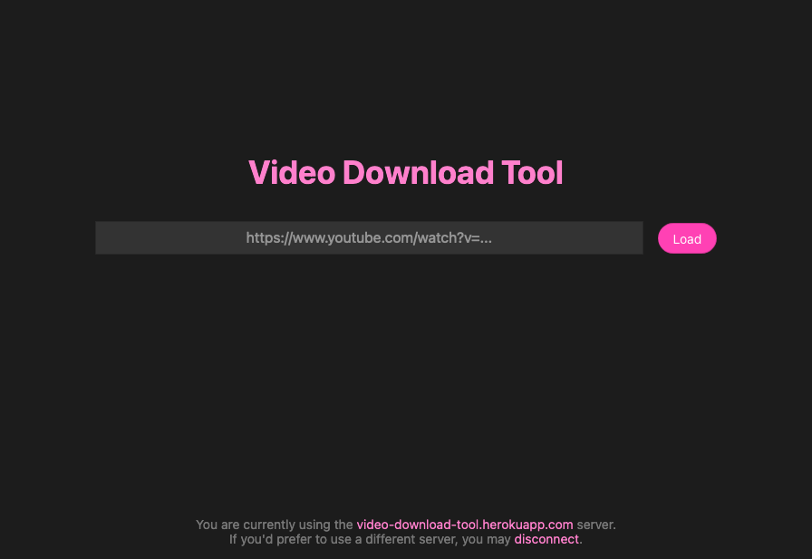

<h1 align="center">
  
</h1>

  Video Download Tool UI
   
  <a href="#about"><strong>Explore the screenshots »</strong></a>
   
   
  <a href="https://github.com/davidguttman/video-download-tool/issues/new?assignees=&labels=bug&template=01_BUG_REPORT.md&title=bug%3A+">Report a Bug</a>
  ·
  <a href="https://github.com/davidguttman/video-download-tool/issues/new?assignees=&labels=enhancement&template=02_FEATURE_REQUEST.md&title=feat%3A+">Request a Feature</a>
  .
  <a href="https://github.com/davidguttman/video-download-tool/issues/new?assignees=&labels=question&template=04_SUPPORT_QUESTION.md&title=support%3A+">Ask a Question</a>

 

Table of Contents

- [About](#about)
  - [Built With](#built-with)
- [Getting Started](#getting-started)
  - [Prerequisites](#prerequisites)
  - [Installation](#installation)
- [Usage](#usage)
- [Roadmap](#roadmap)
- [Support](#support)
- [Project assistance](#project-assistance)
- [Contributing](#contributing)
- [Authors & contributors](#authors--contributors)
- [Security](#security)
- [License](#license)
- [Acknowledgements](#acknowledgements)

---

## About

[VideoDownloadTool.io](//VideoDownloadTool.io) makes it easy to download videos--but only the parts you want. Enter a video's url, select the beginning and end of your clip, optionally crop the video frame, and download.

I created this tool because I often wanted to create short clips to share, and it was time consuming to first download the video and then make manual edits. It's saved me a ton of time and I hope it can do the same for you.

Screenshots

 

|                               Home Page                               |                               Login Page                               |
| :-------------------------------------------------------------------: | :--------------------------------------------------------------------: |
|  |  |

### Built With

* Vanilla JS
* [`nanohtml`](https://github.com/choojs/nanohtml#readme) and [`nanomorph`](https://github.com/choojs/nanomorph#readme)
* [`wildemitter`](https://github.com/HenrikJoreteg/wildemitter#readme) (Node.js-style Event Emitters)
* [Tachyons](//tachyons.io) for style

## Getting Started

### Prerequisites

This repo is for the **Video Download Tool UI**. You can use the hosted version at [VideoDownloadTool.io](//VideoDownloadTool.io). For best results set up your own [Video Download Tool Server](//github.com/davidguttman/video-download-tool-server), but for demo purposes you can use [video-download-tool.herokuapp.com](https://video-download-tool.herokuapp.com).

### Installation

To run the Video Download Tool locally:

* Clone this repo
* `npm install`
* `npm start`

This should start the UI running at [localhost:9966](http://localhost:9966). To connect it to a [Video Download Tool Server](//github.com/davidguttman/video-download-tool-server) visit `http://localhost:9966/?host=$server` where `$server` is the host of the Video Download Tool server you would like to connect to (e.g. `?host=video-download-tool.herokuapp.com`).

## Usage

Once connected to a [Video Download Tool Server](//github.com/davidguttman/video-download-tool-server):

1. Paste in the URL of a video you would like to download
2. Seek to the place you want your download video to start from and click "Set Start Time"
3. Seek to the place you want your downloaded video to end and click "Set End Time"
4. If you'd like to crop the video to a portion of the frame, click "Crop" and drag over the video player to highlight the portion you'd like to crop to
5. Click "Download" to download the trimmed and cropped video

## Roadmap

See the [open issues](https://github.com/davidguttman/video-download-tool/issues) for a list of proposed features (and known issues).

- [Top Feature Requests](https://github.com/davidguttman/video-download-tool/issues?q=label%3Aenhancement+is%3Aopen+sort%3Areactions-%2B1-desc) (Add your votes using the 👍 reaction)
- [Top Bugs](https://github.com/davidguttman/video-download-tool/issues?q=is%3Aissue+is%3Aopen+label%3Abug+sort%3Areactions-%2B1-desc) (Add your votes using the 👍 reaction)
- [Newest Bugs](https://github.com/davidguttman/video-download-tool/issues?q=is%3Aopen+is%3Aissue+label%3Abug)

## Support

Reach out to the maintainer at one of the following places:

- [GitHub issues](https://github.com/davidguttman/video-download-tool/issues/new?assignees=&labels=question&template=04_SUPPORT_QUESTION.md&title=support%3A+)
- The email which is located [in GitHub profile](https://github.com/davidguttman)

## Project assistance

If you want to say **thank you** or/and support active development of Video Download Tool:

- Add a [GitHub Star](https://github.com/davidguttman/video-download-tool) to the project.
- Tweet about the Video Download Tool on your Twitter.
- Write interesting articles about the project on [Dev.to](https://dev.to/), [Medium](https://medium.com/) or personal blog.

Together, we can make Video Download Tool **better**!

## Contributing

First off, thanks for taking the time to contribute! Contributions are what make the open-source community such an amazing place to learn, inspire, and create. Any contributions you make will benefit everybody else and are **greatly appreciated**.

We have set up a separate document containing our [contribution guidelines](docs/CONTRIBUTING.md).

Thank you for being involved!

## Authors & contributors

The original setup of this repository is by [David Guttman](https://github.com/davidguttman).

For a full list of all authors and contributors, check [the contributor's page](https://github.com/davidguttman/video-download-tool/contributors).

## Security

Video Download Tool follows good practices of security, but 100% security can't be granted in software.
Video Download Tool is provided **"as is"** without any **warranty**. Use at your own risk.

_For more info, please refer to the [security](docs/SECURITY.md)._

## License

This project is licensed under the **MIT license**.

See [LICENSE](LICENSE) for more information.

## Acknowledgements

Big thanks to:

* [`yt-dlp`](https://github.com/yt-dlp/yt-dlp) and [`ffmpeg`](https://ffmpeg.org/) for making this possible.
* [`amazing-github-template`](https://github.com/dec0dOS/amazing-github-template#readme) for the README.md template
